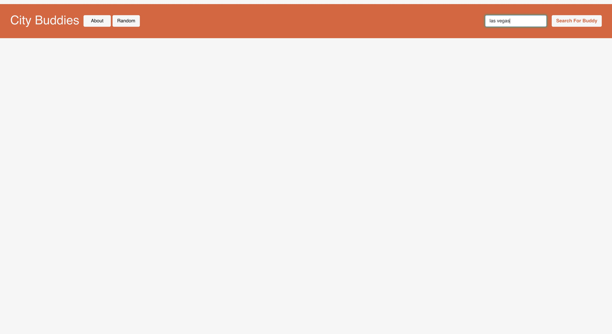
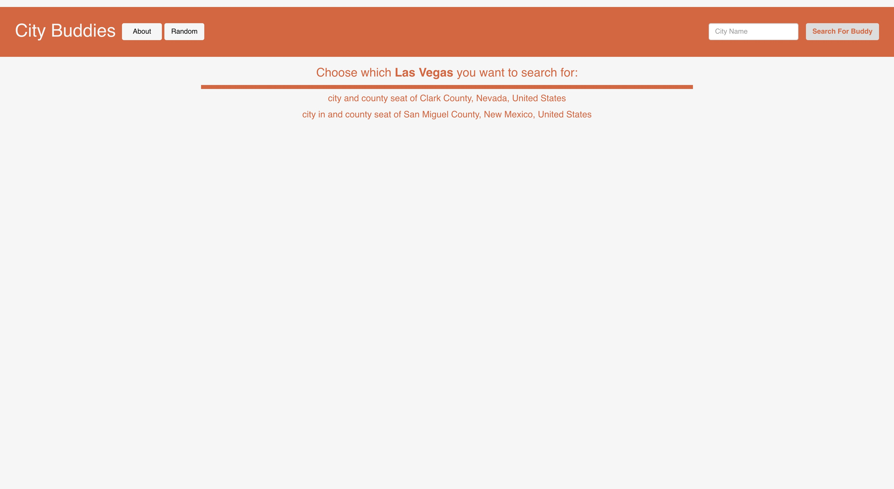

# City Buddies

This Vue JS web app determines which city is the closest to another in terms of population.

_The 'using-backend' branch contains a version of the website that utilizes Node JS + Express for the backend, but does not work on MacOS. The functionality is the same as the main branch._

## Live site

Visit the website live at https://citybuddies.netlify.app/ (runs the main branch)

## Functionality

Every time the website is loaded, an API query is made to the [Wikidata Query Service](https://query.wikidata.org/) that returns the list of all the cities in its database, as well as their populations. This list allows the 'buddy' - the city with the closest population to another - to be calculated.

In the right corner of the website banner, the user can search for the name of any city.



If there are multiple cities with the given name, a list of descriptions for every city with the name will populate the screen. The user can click on one of them to select that city.



Once a selection has been made, the application will inform the user which city is closest in population to the inputted city. Another query is made to Wikidata to get the coordinate of the inputted city and the city nearest in population. Those locations are then given to a map generated by [Leaflet](https://leafletjs.com/) to show the user where the cities are.


The user can choose to view other cities with a similar population on the map.


The web app also works on mobile.


## Project setup

```
npm install
```

### Compiles and hot-reloads for development

```
npm run serve
```

### Compiles and minifies for production

```
npm run build
```

### Customize configuration

See [Configuration Reference](https://cli.vuejs.org/config/).
